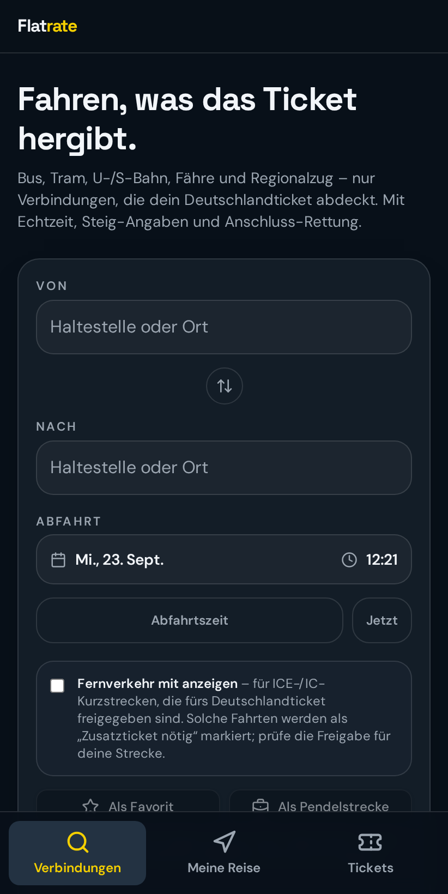
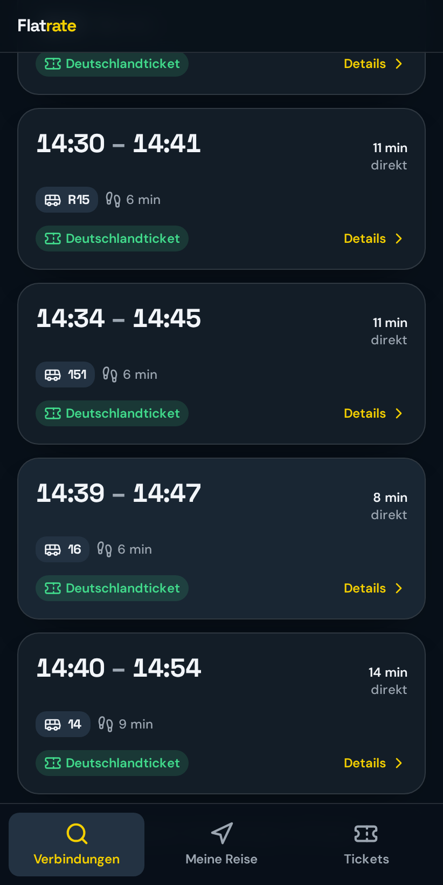
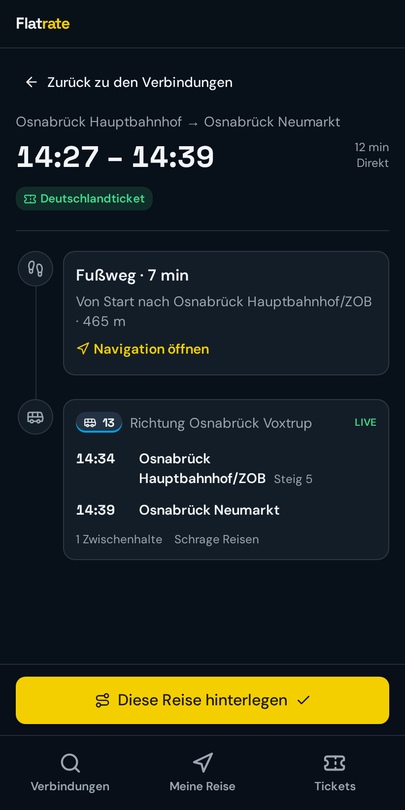
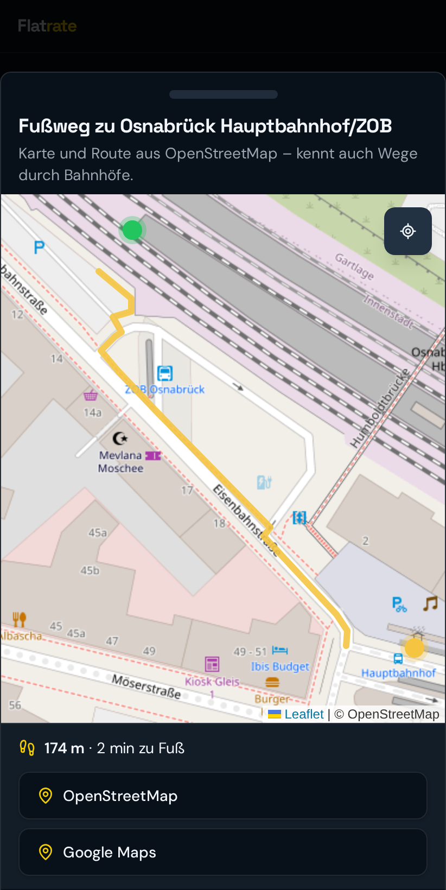
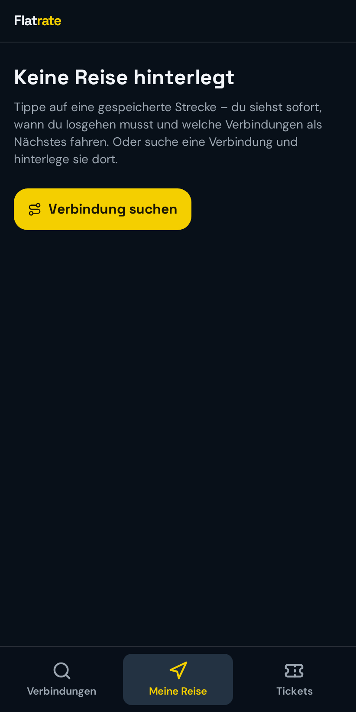
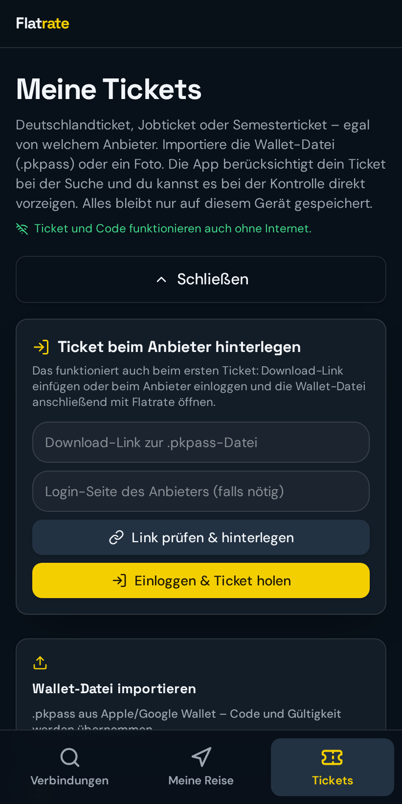

<div align="center">

# Flatrate

**Fahren, was das Ticket hergibt.**

Open-Source-App für Deutschlandticket-, Jobticket- und Semesterticket-Nutzer:
Verbindungen in Echtzeit, Anschluss-Rettung bei Verspätung, Fußweg-Navigation auf
OpenStreetMap-Basis und das eigene Wallet-Ticket offline dabei.

[](https://creativecommons.org/licenses/by-nc/4.0/)


[Android-APK herunterladen](https://github.com/Mindstorms123/Flatrate/raw/main/releases/Flatrate-v1.5.0.apk) · [Pixel-Watch-App](https://github.com/Mindstorms123/Flatrate/raw/main/releases/Flatrate-PixelWatch-v1.5.0.apk) · [Web-App öffnen](https://mindstorms123.github.io/Flatrate/) · [Installieren](#installieren) · [Funktionen](#funktionen) · [Screenshots](#screenshots) · [Selbst bauen](#selbst-bauen)

</div>

---

## Neu in v1.5.0

- **Fußweg zur ersten Haltestelle startet am aktuellen Standort** – Karte, Route und Gehminuten werden live von dort berechnet.
- **Pixel-Watch-App:** haptisches Feedback beim Drehen der Krone zwischen den Etappen; irreführender „Doppelt pinchen"-Hinweis entfernt.
- Downloads: `releases/Flatrate-v1.5.0.apk` (Handy), `releases/Flatrate-PixelWatch-v1.5.0.apk` (Uhr).


### v1.5.0 – Fußwege zur und ab der Haltestelle
- Pendelstrecken: optional **Zuhause** und **Arbeit/Schule** festlegen – der Fußweg zur ersten und ab der letzten Haltestelle wird mit echten Gehminuten eingerechnet (Rückweg automatisch umgekehrt).
- Verbindungsdetails: Button **„Fußweg ab hier“** rechnet den Weg vom aktuellen Standort zur ersten Haltestelle ein; Fußwege lassen sich wieder entfernen.
- Dezenter Hinweis, dass die Zeiten ab der Haltestelle gelten, solange kein Fußweg eingerechnet ist.
- Karte zeigt Fußwege wieder zwischen den geplanten Punkten; optional per Button **„Ab meinem Standort“**.
- Downloads: `releases/Flatrate-v1.5.0.apk` (Handy), `releases/Flatrate-PixelWatch-v1.5.0.apk` (Uhr). Installiert sich über v1.2+ ohne Datenverlust.

## Neu in v1.6.0 – Karte lässt sich frei bewegen

- Die Fußweg-Karte lässt sich jetzt frei verschieben und zoomen, ohne dass das Fenster mitwandert oder sich schließt. Schließen geht über den Griff oben.
- Downloads: [`releases/Flatrate-v1.6.0.apk`](releases/Flatrate-v1.6.0.apk) (Handy), [`releases/Flatrate-PixelWatch-v1.6.0.apk`](releases/Flatrate-PixelWatch-v1.6.0.apk) (Pixel Watch)
- Installiert sich über v1.2+ ohne Datenverlust.

## Was Flatrate macht

Flatrate ist für Menschen gedacht, die mit einer Flatrate im Nahverkehr unterwegs sind.
Die App zeigt nur Fahrten, die das Deutschlandticket abdeckt (Bus, Tram, U-/S-Bahn,
Fähre, Regionalzug) – Fernverkehr lässt sich optional einblenden und wird deutlich als
„Zusatzticket nötig" markiert.

Der Kern ist die **Anschluss-Rettung**: Wenn ein Umstieg durch Verspätung knapp wird,
schlägt die App direkt unter der betroffenen Fahrt die nächsten realen Abfahrten vor –
mit echten Zeiten, Steigen und neuer Ankunftszeit. Ein Tipp darauf baut die Reise um.

## Funktionen

### Verbindungen
- Suche über ganz Deutschland, Haltestellenvorschläge nach Entfernung zum eigenen Standort
- Echtzeitdaten inklusive Verspätungen, Steig-/Gleisänderungen und Ausfällen
- Zusätzliche Abfrage jeder einzelnen Fahrt an der Einstiegshaltestelle (alle 30 s), weil
  manche Verkehrsunternehmen ihre Echtzeit nur dort melden
- „Frühere/Spätere Verbindungen", moderne Datums- und Uhrzeitauswahl
- Detailansicht mit vollständiger Timeline: jede Fahrt, jeder Fußweg, Steige,
  Zwischenhalte und Verkehrsunternehmen

### Anschluss-Rettung
- Erkennung knapper und verpasster Umstiege
- Alternativen erscheinen direkt unter der betroffenen Fahrt, mit der tatsächlichen
  Abfahrtszeit des Ersatzbusses bzw. -zugs
- Antippen übernimmt die Alternative in die angezeigte Reise; „Ursprüngliche Verbindung"
  setzt zurück
- Bei Pendelstrecken werden alle hinterlegten Zielhaltestellen mitgesucht und nach
  schnellster Ankunft zusammengeführt

### Favoriten und Pendelstrecken
- Strecken als Favorit oder Pendelstrecke speichern (erscheinen nur als Hin- und Rückweg)
- Beliebig viele Alternativhaltestellen für Start und Ziel; alle Kombinationen werden
  geprüft, dominierte und doppelte Ergebnisse gefiltert

### Meine Reise (Live-Begleitung)
- Reise hinterlegen und live verfolgen: aktuelles Verkehrsmittel, aktuelle Haltestelle,
  verbleibende Halte, nächster Umstieg mit Steig
- „Ich bin hier" zum Neuplanen unterwegs
- **Android-Live-Update**: eine einzige dauerhafte Live-Anzeige oben in der
  Benachrichtigungsleiste mit animiertem Fortschrittsbalken, Etappen pro Fahrt/Fußweg,
  Umstiegspunkten, Restzeit-Chip und aufklappbarem Reiseverlauf (✓ erledigt, ▶ aktuell).
  Läuft im Hintergrund, bei geschlossener App und ausgeschaltetem Display weiter
  (native Android-16-Darstellung, auf älteren Geräten kompatible Fortschrittsanzeige)
- **Pixel Watch / Wear OS**: eigene Begleit-App zeigt die aktive Reise live auf der Uhr –
  Fortschritt, aktueller Schritt, Restzeit und Symbol auf dem Zifferblatt
- Benachrichtigungen nur noch bei echten Störungen: 10 Minuten vor Reisebeginn, bei Verspätung ab einstellbarer
  Schwelle, bei knappen/verpassten Umstiegen, Steigwechsel und Ausfall

### Navigation
- OpenStreetMap-Karte **direkt in der App** (Leaflet) mit eingezeichnetem Fußweg,
  Entfernung und Gehzeit – Routing über den FOSSGIS-OSRM-Fußgängerdienst
- Kennt Wege *durch* Bahnhöfe und einzelne Steige großer Umsteigeplätze
- Route wird vom geplanten Fußweg-Anfang gezeichnet, nicht vom Sofa aus
- Optional weiter zu OpenStreetMap, Google Maps oder einer installierten Karten-App

### Tickets
- Import von Wallet-Dateien (`.pkpass`) aus Apple/Google Wallet oder als Foto
- Kontrollcode wird Byte für Byte exakt wie in der Wallet-Datei erzeugt; drei
  Code-Varianten für hakelige Prüfgeräte („Code lässt sich nicht scannen?")
- Anbieter-Login öffnet sich in der App; erkannte `.pkpass`-Downloads werden automatisch
  übernommen
- Automatische Erneuerung über einen hinterlegten Download-Link, mit Ablauf-Hinweis
- Ticket und Code funktionieren vollständig **offline**

## Screenshots

| Suche | Verbindungen | Details |
| --- | --- | --- |
|  |  |  |

| Navigation (OpenStreetMap) | Meine Reise | Tickets |
| --- | --- | --- |
|  |  |  |

## Datenquellen

| Zweck | Quelle |
| --- | --- |
| Fahrpläne, Echtzeit, Haltestellensuche | [Transitous](https://transitous.org) (`api.transitous.org`, offenes Community-Projekt auf GTFS/MOTIS-Basis) |
| Karten-Kacheln | [OpenStreetMap](https://www.openstreetmap.org/copyright) |
| Fußgänger-Routing | FOSSGIS-OSRM (`routing.openstreetmap.de`) |

Flatrate nutzt **keine** Schnittstellen der Deutschen Bahn und ist keine offizielle App
eines Verkehrsunternehmens oder Verbunds.

## Datenschutz

- Es gibt **keinen Server und kein Benutzerkonto**. Tickets, Favoriten, Pendelstrecken und
  die aktive Reise liegen ausschließlich lokal auf dem Gerät (`localStorage`).
- Der Standort verlässt das Gerät nur als Koordinate in Fahrplan- und Routing-Anfragen und
  wird nirgends gespeichert oder weitergegeben.
- Wallet-Tickets werden lokal entpackt und gelesen; der Kontrollcode wird auf dem Gerät
  erzeugt.

## Technik

- **React 19** + **TanStack Start / Router** (dateibasiertes Routing in `src/routes`)
- **Vite 8**, **Tailwind CSS v4**, shadcn-Komponenten, **TanStack Query**
- **Capacitor 8** für die Android-App (Local Notifications, Geolocation, Browser, eigenes
  `TicketBrowserPlugin` für den Anbieter-Login samt `.pkpass`-Download)
- **Leaflet** für die In-App-Karte, **fflate** + **bwip-js**/**qrcode** für `.pkpass` und
  Barcodes
- Für den Mobile-Build läuft TanStack Start im SPA-Modus; alle Assets liegen in der APK

Interessante Dateien:

```
src/lib/transit.ts            Fahrplan-Modell, Echtzeit-Updates, Umstiegsrisiken
src/lib/journey-merge.ts      Zusammenführen und Filtern von Verbindungsvarianten
src/lib/active-trip.ts        Live-Fortschritt der hinterlegten Reise
src/lib/notifications.ts      Regeln für alle Benachrichtigungen
src/lib/tickets.ts            .pkpass lesen, Barcode-Bytes, Auto-Erneuerung
src/components/NavMap.tsx     OpenStreetMap-Karte mit Fußweg-Routing
src/routes/journey.tsx        Detailansicht inkl. Anschluss-Rettung
```

## Installieren

### Android

[Flatrate-v1.5.0.apk herunterladen](https://github.com/Mindstorms123/Flatrate/raw/main/releases/Flatrate-v1.5.0.apk)
und auf dem Handy öffnen. Android fragt einmal, ob Apps aus dieser Quelle installiert
werden dürfen. Beim ersten Start fragt die App nach Benachrichtigungen und Standort.

**Updates:** Ab v1.2 haben alle Versionen dieselbe feste Signatur – neue Versionen
installieren sich einfach über die alte, Tickets und Einstellungen bleiben erhalten.
Kommst du von v1.0/v1.1, einmalig vorher auf der Ticketseite „Sicherung speichern",
alte App deinstallieren, neue installieren, „Sicherung zurückholen".

### Pixel Watch / Wear OS (optional)

Die Live-Anzeige des Handys wird von Wear OS nicht zuverlässig auf die Uhr gespiegelt.
Dafür gibt es eine kleine Begleit-App, die die aktive Reise vom Handy übernimmt.
Ohne Play Store muss sie einmalig per Computer installiert werden:

1. Auf der Uhr: Einstellungen → System → Info → 7× auf „Build-Nummer" tippen.
2. Einstellungen → Entwickleroptionen → „Debugging über WLAN" einschalten
   (Uhr und Computer im selben WLAN). Dort „Neues Gerät koppeln" antippen.
3. Am Computer mit den [Android Platform Tools](https://developer.android.com/tools/releases/platform-tools):
   ```sh
   adb pair <IP:Kopplungs-Port> <Code>
   adb connect <IP:Port>
   adb install Flatrate-PixelWatch-v1.5.0.apk
   ```
4. Flatrate einmal auf der Uhr öffnen und Benachrichtigungen erlauben.

Sobald auf dem Handy eine Reise hinterlegt ist, erscheint sie live auf der Uhr.
Die Handy-App muss dafür v1.3 oder neuer sein.

### iPhone / iPad (Web-App auf dem Home-Bildschirm)

Für iOS gibt es keine Installationsdatei – Apple erlaubt das nur über den App Store.
Flatrate läuft auf dem iPhone deshalb als Web-App, die sich wie eine App ablegen lässt:

1. **<https://mindstorms123.github.io/Flatrate/>** in **Safari** öffnen
   (Chrome auf dem iPhone kann das nicht).
2. Auf **Teilen** (Pfeil nach oben) tippen.
3. **Zum Home-Bildschirm** wählen und bestätigen.

Danach liegt Flatrate mit eigenem Symbol auf dem Home-Bildschirm, startet im Vollbild ohne
Safari-Leiste und zeigt Tickets samt Kontrollcode auch ohne Internet. Der Funktionsumfang
ist derselbe wie in der Android-App.

Zwei Unterschiede bleiben:

- Benachrichtigungen funktionieren auf dem iPhone nur ab iOS 16.4 und nur, wenn die App
  über „Zum Home-Bildschirm" abgelegt wurde – nicht im normalen Safari-Tab.
- Wallet-Dateien nimmt iOS nicht per Teilen-Menü an; importiere `.pkpass`-Dateien auf dem
  iPhone über „Neues Ticket hinzufügen" → Datei auswählen oder über einen Download-Link.

### Jeder andere Browser

<https://mindstorms123.github.io/Flatrate/> funktioniert auch auf Android, Windows, macOS
und Linux. In Chrome/Edge lässt sich die App über das Installieren-Symbol in der
Adressleiste ablegen.

Die Web-Version wird von GitHub Pages ausgeliefert und bei jeder Änderung am Code
automatisch neu gebaut (`.github/workflows/pages.yml`). Es gibt keinen eigenen Server:
alle Fahrplan- und Routing-Anfragen gehen direkt vom Gerät an Transitous bzw. OSRM.

## Selbst bauen

Voraussetzungen: [Bun](https://bun.sh) (oder npm), für Android zusätzlich JDK 21 und das
Android SDK (Platform 36, Build-Tools 35).

```sh
git clone https://github.com/Mindstorms123/Flatrate.git
cd Flatrate
bun install
bun run dev            # Web-Version auf http://localhost:8080
```

Android-APK:

```sh
echo "sdk.dir=/pfad/zum/android-sdk" > android/local.properties
bun run android:apk    # Web-Build + cap sync + gradlew assembleDebug
# Ergebnis: android/app/build/outputs/apk/debug/app-debug.apk

# Pixel-Watch-App
cd android && ./gradlew :wear:assembleDebug
# Ergebnis: android/wear/build/outputs/apk/debug/wear-debug.apk
```

Statische Web-Version (das, was auf GitHub Pages liegt):

```sh
PAGES_BASE=/Flatrate/ bun run build:pages
# Ergebnis: dist/client – beliebig statisch hostbar
```

## Mitmachen

Issues und Pull Requests sind willkommen – besonders zu Verbundgebieten, in denen
Echtzeitdaten fehlen oder abweichen. Bitte beschreibe dabei Haltestelle, Linie und
Uhrzeit, damit die Fahrt nachvollziehbar ist.

## Lizenz

https://creativecommons.org/licenses/by-nc/4.0/
Copyright (c) 2026 Flatrate Leon Wüste.

Kartendaten © OpenStreetMap-Mitwirkende (ODbL). Fahrplandaten über Transitous stammen von
den jeweiligen Verkehrsverbünden. „Deutschlandticket" ist nur als beschreibender Begriff
verwendet; es besteht keine Verbindung zu Verkehrsunternehmen oder Verbünden.
